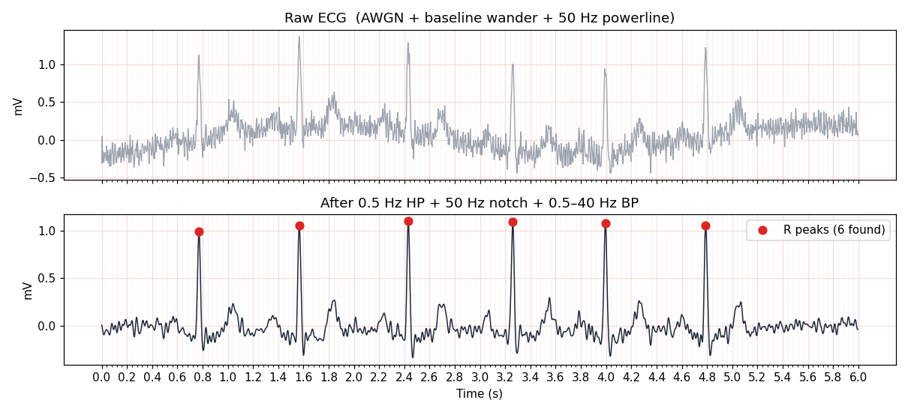
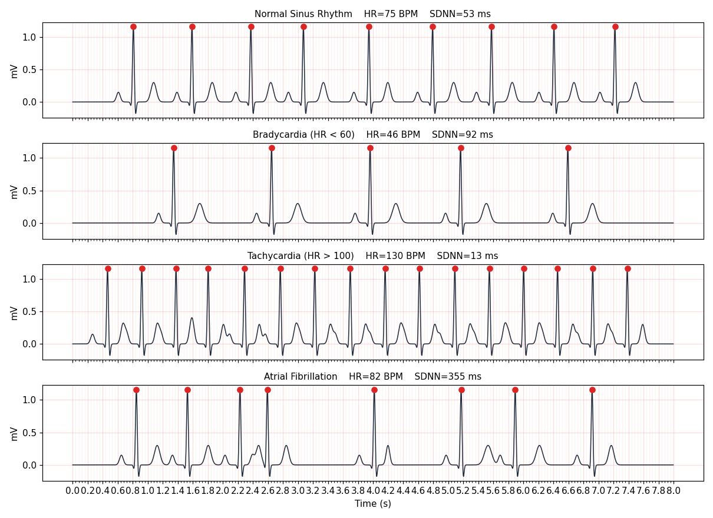
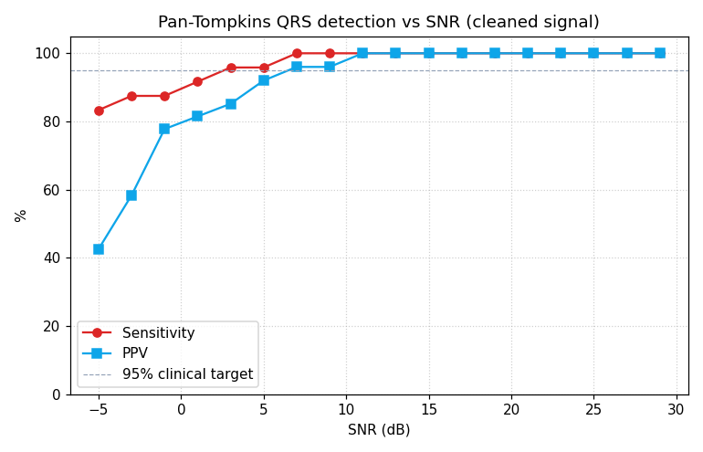
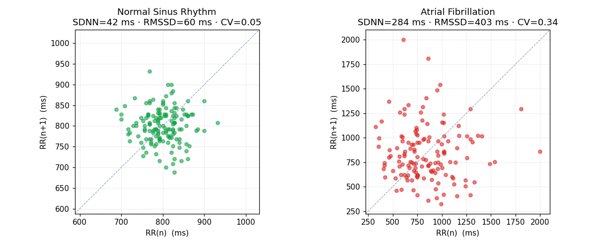

# cardiac-monitor
ingle-lead ECG simulator + Pan-Tompkins QRS detection + HRV analysis + live Streamlit dashboard. Built from scratch in numpy. 
# Cardiac Monitor — Live ECG Dashboard

[](https://github.com/chethanadasari/cardiac-monitor/actions/workflows/tests.yml)
[](https://share.streamlit.io)
[](https://www.python.org/downloads/)
[](LICENSE)

A single-lead ECG signal-processing pipeline and live web dashboard, built
end-to-end in Python. Generates synthetic ECG with four common rhythms
(normal, bradycardia, tachycardia, atrial fibrillation), corrupts it with
realistic clinical noise sources, then runs a classical Pan-Tompkins QRS
detector, computes time-domain HRV metrics, and classifies the rhythm in
real time.

> ⚠️ **Educational simulator — not a medical device.**

## Live demo

Once deployed to [Streamlit Community Cloud](https://share.streamlit.io)
the dashboard runs in any browser, with sliders for rhythm, heart rate,
noise level, and filtering, and a live-scrolling ECG strip with R-peaks
overlaid in real time:



## Results

### Four rhythms generated and detected

The same generator + detector pipeline handles all four rhythms; per-rhythm
HR and SDNN match clinical expectations.



### DSP cleanup pipeline

A 0.5 Hz high-pass plus 50 Hz notch plus 0.5–40 Hz bandpass — all
implemented from scratch with windowed-sinc FIRs (no scipy) — recover
the underlying QRS complexes from a heavily corrupted recording.


### QRS detection performance vs SNR

Pan-Tompkins detection sensitivity stays above the 95 % clinical target
(AAMI EC57) down to ~5 dB SNR after the cleaning pipeline.



### Poincaré plots — Normal vs AFib

Tight cluster around the line of identity for normal sinus rhythm; a
diffuse cloud with no structure in atrial fibrillation. Textbook
presentation of the rhythm as seen on Holter devices.



## Project layout

```
cardiac-monitor/
├── app.py                         # Streamlit dashboard entry point
├── src/
│   ├── ecg_generator.py           # Synthetic ECG with 4 rhythms + 3 noise sources
│   ├── filters.py                 # Bandpass / notch / baseline-removal FIRs
│   ├── qrs_detector.py            # Pan-Tompkins R-peak detection
│   └── hrv.py                     # SDNN, RMSSD, pNN50 + rhythm classifier
├── tests/
│   └── test_cardiac.py            # 23 pytest cases
├── notebooks/
│   └── run_analysis.py            # Regenerate every plot in this README
├── results/                       # Generated PNGs (committed)
├── .github/workflows/tests.yml    # CI on Python 3.10/3.11/3.12
├── requirements.txt
└── LICENSE
```

## Quick start

```bash
git clone https://github.com/chethanadasari/cardiac-monitor
cd cardiac-monitor
pip install -r requirements.txt

# Run the test suite
pytest tests/ -v

# Reproduce every plot in this README
python notebooks/run_analysis.py

# Launch the live dashboard locally
streamlit run app.py
```

## Deploy the dashboard publicly (free)

1. Push this repo to GitHub.
2. Sign in at [share.streamlit.io](https://share.streamlit.io) with your
   GitHub account.
3. Click **New app** → pick this repo → main branch → `app.py` → **Deploy**.
4. ~2 minutes later you have a live URL like
   `cardiac-monitor-<your-handle>.streamlit.app` you can share with
   recruiters at Boston Scientific, Medtronic, ResMed, or anyone else.

## Theory in 90 seconds

A single-lead ECG records the projected vector of cardiac depolarisation
on a body-surface lead. Each heartbeat produces a stereotyped P–Q–R–S–T
complex; the **R peak** is the high-amplitude sharp deflection from
ventricular depolarisation.

**Three noise sources** dominate clinical recordings:

- **Baseline wander** — sub-1 Hz drift caused by respiration and electrode
  motion. Removed with a 0.5 Hz high-pass.
- **Powerline interference** — 50 Hz (EU/IE) or 60 Hz (US) capacitive
  pickup. Removed with a narrow notch.
- **Muscle / motion artefact** — broadband above ~40 Hz. Suppressed by a
  bandpass to the cardiac band.

**Pan-Tompkins** (Pan & Tompkins 1985, IEEE TBME) is the canonical
real-time QRS detector and is still the baseline used in
clinical-grade pacemakers, ICDs, and Holter monitors. The pipeline is:

```
bandpass 5–15 Hz  →  derivative  →  square  →
moving-window integration ~150 ms  →  adaptive thresholding
```

Adaptive thresholds with refractory period and search-back keep
sensitivity high without inflating false positives.

**HRV metrics** (Task Force ESC / NASPE 1996) summarise beat-to-beat
variability:

| Metric  | Meaning                                          | Use                                |
|---------|--------------------------------------------------|------------------------------------|
| SDNN    | Std-dev of all RR intervals                      | Overall variability                |
| RMSSD   | RMS of successive RR differences                 | Vagal / parasympathetic tone       |
| pNN50   | % of RR pairs differing by >50 ms                | Short-term variability             |
| CV      | SDNN / mean RR                                   | Normalised variability             |

The classifier is rule-based: AFib whenever beat-to-beat irregularity
crosses a CV / pNN50 threshold; otherwise brady/tachy/normal by mean HR
band. Simple, transparent, and easy to validate against MIT-BIH or a
clinical gold-standard label set later.

## Tests

```bash
pytest tests/ -v
```

Covers:

- ECG generator HR matches each rhythm's expected band
- AFib RR intervals are at least 2× more variable than normal
- FIR bandpass passes 10 Hz and rejects DC
- 50 Hz notch attenuates powerline by >10×
- Baseline-wander removal kills 0.2 Hz drift
- Cleaning pipeline preserves QRS amplitude
- Pan-Tompkins ≥ 95 % sensitivity / PPV on clean signals
- Pan-Tompkins ≥ 85 % sensitivity / PPV at 10 dB SNR after cleaning
- HRV metrics produce the expected SDNN / CV / pNN50 ranges
- Rhythm classifier round-trips all four rhythms

## Roadmap — what would push this further

- Validate the detector against the MIT-BIH Arrhythmia Database
  (PhysioNet) and report sensitivity / PPV per AAMI EC57.
- Add a learned classifier (1-D CNN or random forest on
  HRV+morphology features) and benchmark vs the rule-based baseline.
- Multi-lead simulation and 12-lead montage view.
- Export reports as PDF for a clinician-style trace + summary.
- Real-data ingest from a wearable (Polar H10, ANT+, BLE GATT) for an
  end-to-end embedded → cloud → dashboard demo.

## License

[MIT](LICENSE) — educational use only, see disclaimer in the LICENSE file.
